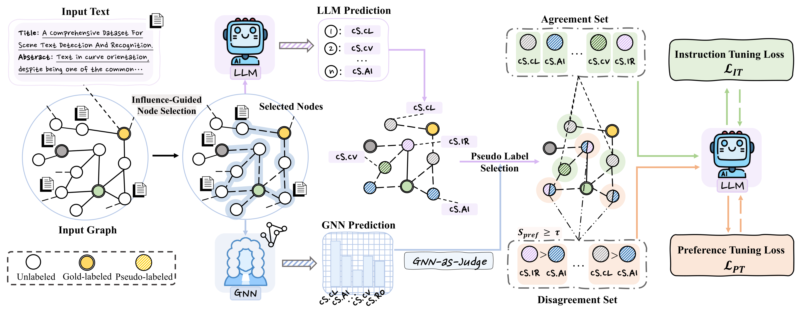

# GNN-as-Judge

Implementation of **"GNN-as-Judge: Unleashing the Power of LLMs for Graph Learning with GNN Feedback"** (ICLR 2026).

## Overview
Large Language Models (LLMs) have shown strong performance on text-attributed graphs (TAGs) due to their superior semantic understanding ability on textual node features. However, their effectiveness as predictors in the low-resource setting, where labeled nodes are severely limited and scarce, remains constrained since fine-tuning LLMs usually requires sufficient labeled data, especially when the TAG shows complex structural patterns. In essence, this paper targets two key challenges: (i) the difficulty of generating and selecting reliable pseudo labels on TAGs for LLMs, and (ii) the need to mitigate potential label noise when fine-tuning LLMs with pseudo labels. To counter the challenges, we propose a new framework, GNN-as-Judge, which can unleash the power of LLMs for few-shot semi-supervised learning on TAGs by incorporating the structural inductive bias of Graph Neural Networks (GNNs). Specifically, GNN-as-Judge introduces a collaborative pseudo-labeling strategy that first identifies the most influenced unlabeled nodes from labeled nodes, then exploits both the agreement and disagreement patterns between LLMs and GNNs to generate reliable labels. Furthermore, we develop a weakly-supervised LLM fine-tuning algorithm that can distill the knowledge from informative pseudo labels while mitigating the potential label noise. Experiments on multiple TAG datasets demonstrate that GNN-as-Judge significantly outperforms existing methods, particularly in low-resource regimes where labeled data are scarce.

<p align="center">
  
</p>

## Project Structure

```
GNN_as_Judge/
├── common/                     # Shared utilities and models
│   ├── __init__.py
│   ├── gnn.py                  # GNN architectures (GCN, GAT, SAGE, SGConv)
│   ├── hetero_gnn.py           # Heterogeneous GNN (H2GCN)
│   ├── dataloader.py           # Graph dataset loading and few-shot splitting
│   ├── prompt.py               # Prompt templates for each dataset
│   ├── utils.py                # Utility functions (seeding, adjacency ops)
│   ├── metrics.py              # Evaluation metrics (accuracy, F1)
│   ├── ckpt.py                 # Checkpoint saving/loading
│   └── constant.py             # Constants
├── GNN/                        # GNN training scripts
│   ├── main.py                 # Train GNN models on graph datasets
│   └── embedding.py            # Generate node embeddings with language models
├── LLaMA-Factory/              # LLM training framework (for SFT and DPO)
│   └── ...                     # See LLaMA-Factory README for details
├── datasets/                   # Graph dataset files (.pt format)
├── results/                    # Output directory for trained models
├── create_sft.py               # Create SFT training data from graph
├── create_wsft.py              # Create WSFT dataset using GNN-as-Judge
├── node_selection.py           # Core node agreement/disagreement logic
├── select_influential_nodes.py # Graph-based influential node selection
├── evaluate_predictions.py     # Evaluate LLM prediction accuracy
├── pipeline.sh                 # End-to-end pipeline script
├── config_example.sh           # Configuration template
└── environment.yml             # Conda environment specification
```

## Installation

Create the conda environment from the provided `environment.yml`:

```bash
conda env create -f environment.yml
conda activate GNNJudge
```

Then install LLaMA-Factory:

```bash
cd LLaMA-Factory
pip install -e ".[torch,metrics]" --no-build-isolation
cd ..
```

## Dataset Preparation

The graph datasets used in this project are based on [LLMNodeBed](https://github.com/WxxShirley/LLMNodeBed).

Download the pre-processed graph datasets from [Google Drive](https://drive.google.com/file/d/14GmRVwhP1pUD_OIhoJU3oATZWTnklhPG/view) and place them in the `datasets/` directory:

```
datasets/
├── cora.pt
├── citeseer.pt
├── pubmed.pt
└── arxiv.pt
```

## Quick Start

### Step 1: Train a GNN

First, train a GNN model that will serve as the judge. 

```bash
cd GNN
python main.py \
  --dataset cora \
  --shots 3 \
  --gnn_type GCN \
  --hidden_dim 64 \
  --n_layers 2 \
  --epochs 200 \
  --seed 42
cd ..
```

### Step 2: Run the full pipeline

Configure your settings:
```bash
cp config_example.sh config.sh
# Edit config.sh with your paths and hyperparameters
```

Run the pipeline:
```bash
./pipeline.sh cora 3 42
```
## Configuration

See `config_example.sh` for all configurable parameters including:
- Model paths and templates
- GNN architecture settings
- SFT/DPO training hyperparameters
- Hardware configuration (GPU, batch sizes)
- Node selection parameters

## Acknowledgements

This project builds upon the following work:

- **[LLMNodeBed](https://github.com/WxxShirley/LLMNodeBed)** -- Graph datasets and benchmark for evaluating LLMs on node classification tasks. The datasets used in this project can be downloaded from [Google Drive](https://drive.google.com/file/d/14GmRVwhP1pUD_OIhoJU3oATZWTnklhPG/view).
- **[LLaMA-Factory](https://github.com/hiyouga/LLaMA-Factory)** -- LLM fine-tuning framework used for SFT and DPO training.

## License

This project is licensed under the MIT License - see the [LICENSE](LICENSE) file for details.

